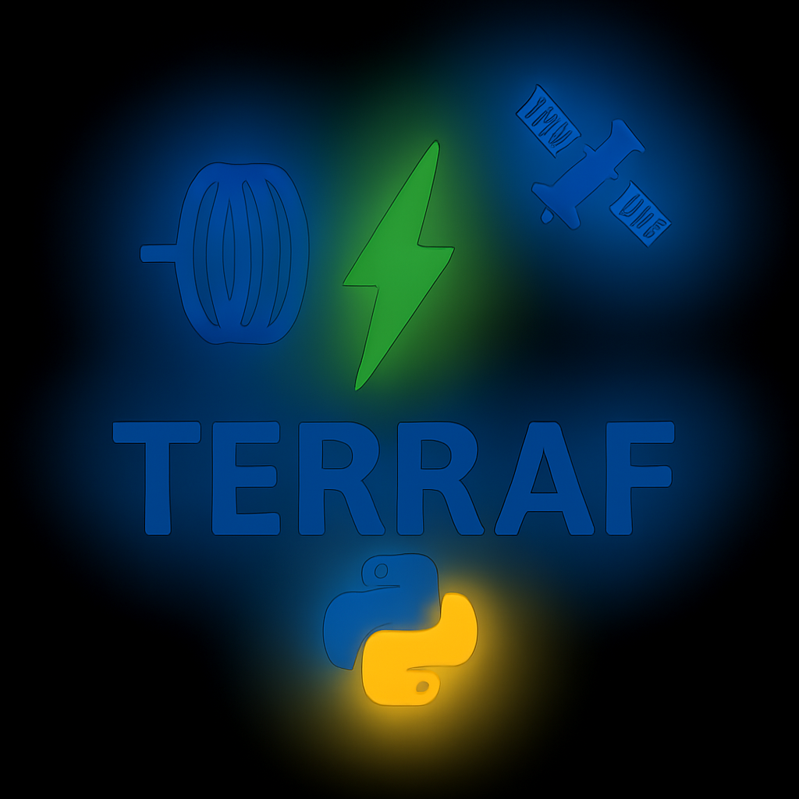

<div align="center">
  
  
  # 🛰️ TERRAF PR
  ### Percepción Remota para Exploración Minera
  
  
  
  
</div>

---

## 📖 Descripción

**TERRAF** es una plataforma integral para exploración geofísica y minera que combina múltiples técnicas de análisis:

- 🛰️ **Percepción Remota:** Análisis de imágenes satelitales Landsat para detección de alteración hidrotermal
- 🧲 **Magnetometría:** Procesamiento e interpretación de datos magnéticos (próximamente)
- ⚖️ **Gravimetría:** Análisis de anomalías gravimétricas (próximamente)

*Actualmente en desarrollo: módulo de percepción remota (TERRAF PR)*

### 🎯 Características Actuales (Percepción Remota)

- ✅ Carga automática de bandas Landsat 8/9 (Level-1 y Level-2)
- ✅ Composiciones RGB (natural, falso color, geología)
- ✅ Índices espectrales avanzados para detección mineral
- ✅ Detección de alteración hidrotermal
- ✅ Visualización interactiva y exportación de resultados
- ✅ Análisis de zonas de interés con cálculo de áreas

---

## 🚀 Instalación

### Instalación del Entorno Completo

El proyecto incluye un entorno conda con todas las dependencias necesarias (incluyendo librerías de geofísica para futuros desarrollos):

```bash
# Clonar el repositorio
git clone https://github.com/terraf360/terraf.git
cd terraf

# Crear entorno conda desde el archivo
conda env create -f conda/environment.yml

# Activar el entorno
conda activate terraf
```

### Uso Básico

```python
from terraf_pr import TerrafPR

# Crear instancia
pr = TerrafPR("ruta/a/datos/landsat", nombre="MiRegion")

# Cargar bandas
pr.cargar_bandas(reducir=True, factor=4)

# Calcular índices
pr.calcular_gossan()
pr.calcular_propilitica()
pr.calcular_ndvi()

# Visualizar y guardar
pr.show('gossan', guardar=True)
```

---

## 📊 Índices Disponibles

### 1. 🎯 Índice GOSSAN

<div align="center">
  
</div>

**Fórmula:** `(B4/B2) × (B6/B7)`

**Utilidad:** Identifica "sombreros de hierro" (gossans) que se forman sobre depósitos de sulfuros metálicos oxidados. Combina la detección de óxidos de hierro con alteración argílica.

**Minerales detectados:** Hematita, Goethita, Limonita, Jarosita

**Aplicación:** Alta prioridad para exploración de depósitos de sulfuros metálicos (Cu, Pb, Zn, Au, Ag)

---

### 2. 🌿 Alteración Propilítica

<div align="center">
  
</div>

**Fórmula:** `B5/B6`

**Utilidad:** Detecta alteración propilítica, característica de zonas periféricas a sistemas hidrotermales. Indica la presencia de minerales verdes de baja temperatura.

**Minerales detectados:** Clorita, Epidota, Calcita

**Aplicación:** Delimita halos externos de sistemas porfídicos y epitermales

---

### 3. 🌱 NDVI - Índice de Vegetación

<div align="center">
  
</div>

**Fórmula:** `(B5 - B4) / (B5 + B4)`

**Utilidad:** Identifica áreas con vegetación densa para filtrarlas del análisis mineral. Zonas con vegetación escasa o nula son más favorables para detección de alteración.

**Clasificación:**
- NDVI > 0.6: Vegetación densa
- 0.3 - 0.6: Vegetación moderada  
- 0.2 - 0.3: Vegetación escasa
- < 0.2: Sin vegetación (óptimo para análisis mineral)

**Aplicación:** Herramienta de filtrado para enfocarse en áreas con roca expuesta

---

### 4. 🪨 Índice de Carbonatos

<div align="center">
  
</div>

**Fórmula:** `B6 / (B6 + B7)`

**Utilidad:** Detecta rocas carbonatadas y alteración carbonática asociada a sistemas hidrotermales. Valores bajos indican presencia de carbonatos.

**Minerales detectados:** Calcita, Dolomita, Ankerita

**Aplicación:** Útil en prospectos epitermales y sistemas tipo skarn

---

### 5. 🟤 Clay Index - Arcillas Mejorado

<div align="center">
  
</div>

**Fórmula:** `(B6 × B6) / (B7 × B5)`

**Utilidad:** Versión mejorada del ratio de arcillas tradicional (B6/B7). Proporciona mayor contraste y precisión en la detección de alteración argílica.

**Minerales detectados:** Caolinita, Alunita, Illita, Montmorillonita

**Aplicación:** Mapeo detallado de zonas de alteración argílica avanzada (núcleos de sistemas epitermales y porfídicos)

---

## 📂 Estructura del Proyecto

```text
terraf/
├── conda/
│   └── environment.yml       # Entorno conda completo
├── src/
│   └── terraf_pr.py          # Módulo de percepción remota
├── test/
│   └── pruebas.py            # Script de pruebas
├── datos/
│   └── landsat9/             # Datos satelitales
├── resultados/               # Imágenes exportadas
├── images/
│   └── logo_terraf_placeholder.png
└── README.md
```

### Contenido del Entorno

El archivo `conda/environment.yml` incluye:

**Librerías actuales (Percepción Remota):**
- `rasterio` - Lectura de imágenes satelitales
- `numpy`, `scipy` - Procesamiento numérico
- `matplotlib` - Visualización
- `pandas` - Manejo de datos

**Librerías preparadas (Geofísica - próximamente):**
- `simpeg`, `discretize`, `pygimli` - Inversión geofísica
- `harmonica`, `verde` - Procesamiento de datos potenciales
- `pyvista`, `vtk` - Visualización 3D

---

## 🔬 Flujo de Trabajo Recomendado

1. **Carga de datos:** Descarga escenas Landsat de tu área de interés
2. **Preprocesamiento:** Carga bandas con reducción opcional para análisis rápido
3. **Análisis inicial:**
   - NDVI: Identificar áreas con roca expuesta
   - Gossan: Buscar indicios de sulfuros
4. **Análisis detallado:**
   - Alteración argílica (Clay Index)
   - Alteración propilítica
   - Carbonatos
5. **Integración:** Combinar múltiples índices para priorizar zonas
6. **Exportación:** Guardar resultados para análisis GIS

---

## 📝 Ejemplo Completo

Ver `test/pruebas.py` para un ejemplo completo que ejecuta todos los índices y guarda los resultados automáticamente en la carpeta `resultados/`.

```bash
python test/pruebas.py
```

---

## 🤝 Contribuciones

Contribuciones, issues y solicitudes de features son bienvenidas.

**Repositorio principal:** [terraf360/terraf](https://github.com/terraf360/terraf)

---

## 📄 Licencia

Copyright © 2025 José / Proyecto TERRAF

Todos los derechos reservados. Este repositorio es privado. El código y la documentación aquí contenida no pueden ser copiados, distribuidos ni utilizados sin autorización expresa.

---

## 📚 Referencias

- USGS Landsat Collection 2
- Sabins, F.F. (1999). Remote Sensing for Mineral Exploration
- Gupta, R.P. (2017). Remote Sensing Geology

---

<div align="center">
  <sub>Desarrollado con 💻 para la comunidad de exploración minera</sub>
</div>